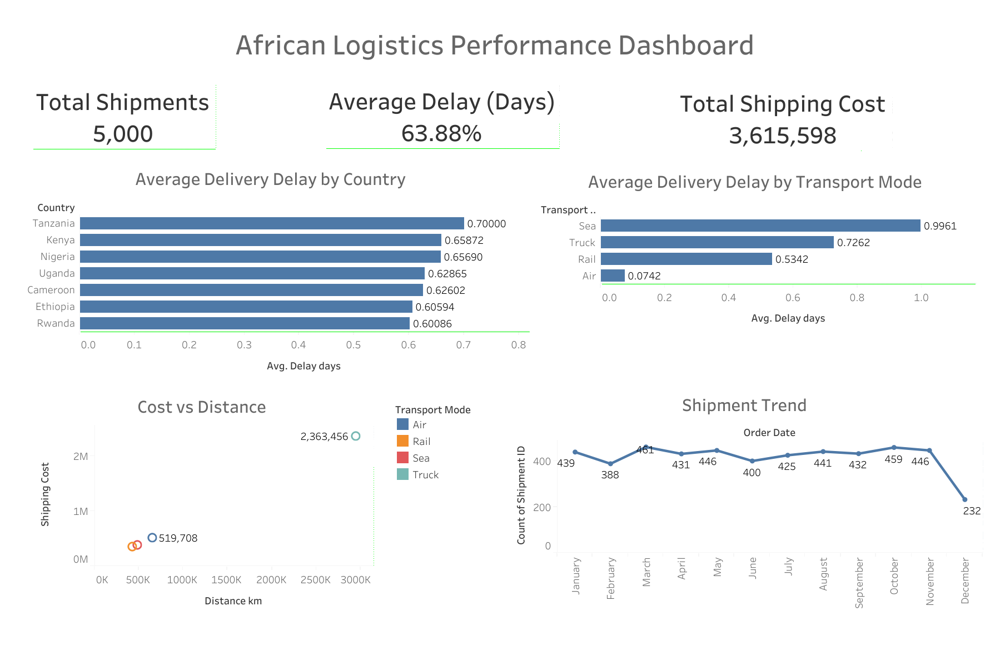

# African Logistics Performance Optimization

## Project Overview

Efficient logistics systems are essential for economic development and trade growth across African markets. However, logistics operations often face challenges including delivery delays, infrastructure limitations, and cost inefficiencies.

This project analyzes logistics performance across multiple African countries using data analytics and visualization techniques to identify operational bottlenecks and propose optimization strategies.

The analysis combines **R for data analysis** and **Tableau for interactive visualization**, enabling strategic insights for logistics performance improvement.

---

# Business Context

Supply chain efficiency is a critical competitive advantage for logistics operators across emerging markets.

African logistics networks face structural challenges including:

- long transportation distances
- infrastructure constraints
- variable delivery reliability
- high operational costs

Improving logistics efficiency can significantly enhance delivery performance, customer satisfaction, and operational profitability.

---

# Business Problem

How can data analytics identify inefficiencies in logistics operations and support data-driven decision making to improve supply chain performance across African markets?

---

# Dataset

The dataset contains **5000 simulated logistics shipments across African logistics networks**.

Each record represents a shipment transaction including operational and financial attributes.

### Key Variables

- Country
- City
- Warehouse
- Transport Mode
- Distance (km)
- Delivery Time (days)
- Expected Delivery Time
- Shipping Cost
- Order Value
- Order Date

Dataset location in repository:

data/logistics_dataset.csv

---

# Analytical Methodology

The analysis follows a structured data analytics workflow.

## 1 Data Preparation

Performed using **R**

Key steps:

- Data cleaning
- Delivery delay calculation
- Feature transformation
- Data formatting for visualization

Notebook location:

notebooks/african_logistics_analysis.Rmd

---

## 2 Exploratory Data Analysis

The exploratory analysis focuses on identifying patterns in logistics operations such as:

- shipment distribution across countries
- delivery delay patterns
- shipping cost vs distance relationships
- shipment demand trends over time

These analyses help uncover operational inefficiencies and performance variability across logistics networks.

---

# Tableau Strategic Dashboard

A strategic dashboard was developed in Tableau to visualize logistics performance indicators.

Dashboard file location:

dashboards/logistics_dashboard.twbx

The dashboard provides a visual overview of:

- logistics shipment distribution
- average delivery delays
- transport mode performance
- shipping cost efficiency
- demand trends

---

# Dashboard Preview

---

# Key Insights

## Delivery Delay Patterns

Certain logistics corridors show significantly higher delivery delays, indicating potential infrastructure constraints or route inefficiencies.

## Transport Mode Performance

Road transportation shows the highest variability in delivery time, suggesting opportunities for route optimization and scheduling improvements.

## Cost Efficiency

Shipping costs generally increase with transport distance, but some routes display cost anomalies that may indicate operational inefficiencies.

## Shipment Demand Growth

Shipment volume trends indicate increasing logistics demand, reinforcing the importance of scalable logistics infrastructure and optimized operational planning.

---

# Strategic Recommendations

Based on the analysis, several operational improvements can be implemented.

### Route Optimization

Identify and optimize high-delay logistics corridors using route performance analytics.

### Transport Mode Optimization

Improve allocation of transport modes depending on shipment distance, urgency, and infrastructure availability.

### Predictive Monitoring

Deploy predictive analytics models to detect high-risk shipments likely to experience delays.

### Cost Efficiency Metrics

Develop operational KPIs to monitor logistics cost efficiency across routes and transport modes.

---

# Tools & Technologies

This project uses the following analytics stack:

- R
- R Markdown
- Tableau
- Data Visualization
- Supply Chain Analytics

---

# Repository Structure

african-logistics-performance-optimization

README.md

data/
logistics_dataset.csv

notebooks/
african_logistics_analysis.Rmd

dashboards/
logistics_dashboard.twbx

images/
african_logistics_dashboard.png

---

# Author

Franck Djandja

Data Analyst | Business Intelligence | Predictive Analytics

Focus Areas:
- Fintech Analytics
- Logistics & Supply Chain Analytics
- Industrial Data Analytics in Africa
